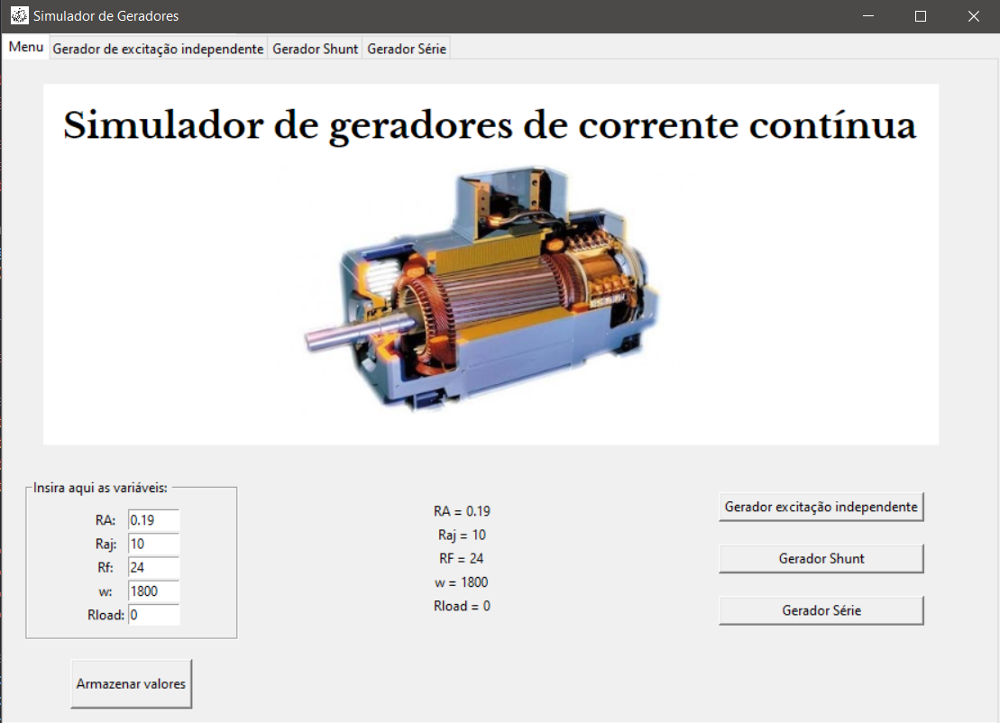
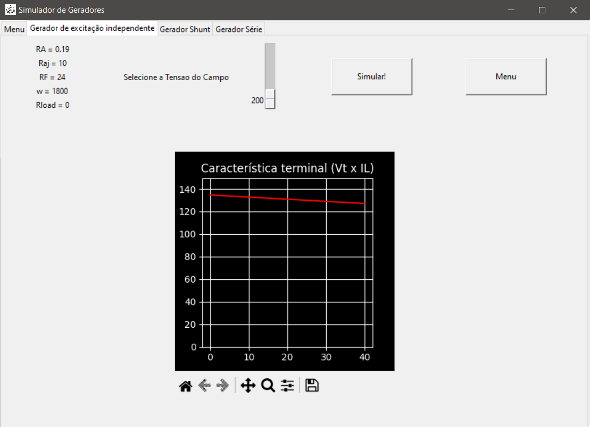
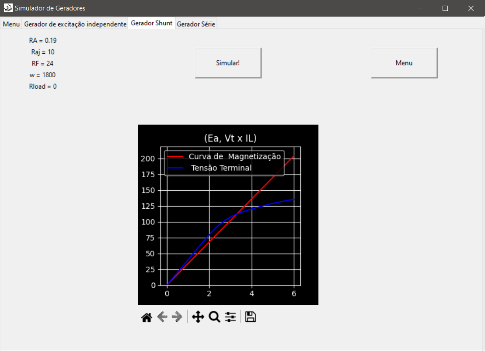
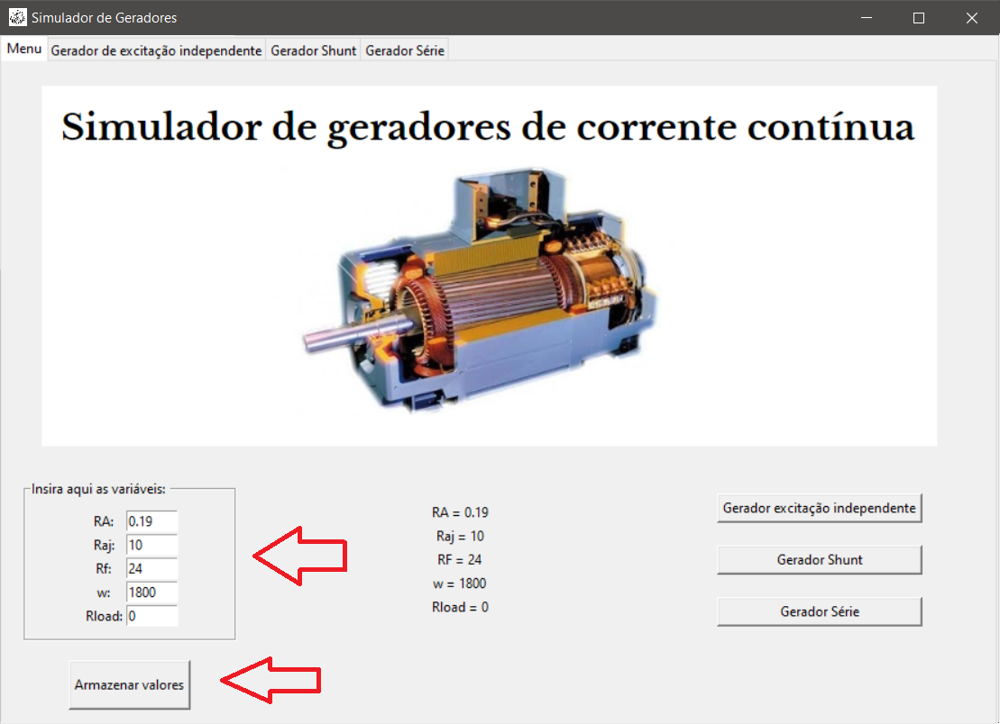
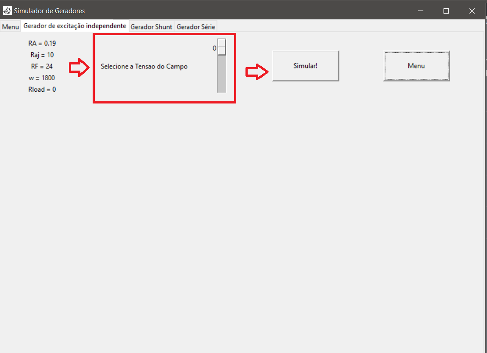
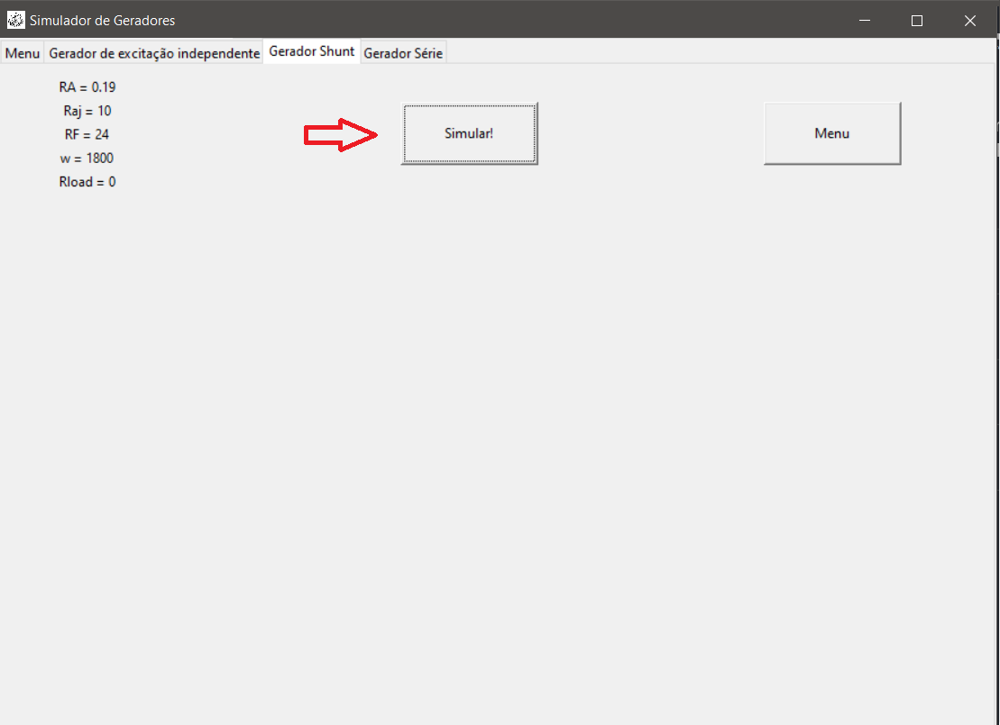

# Características terminais e Funcionamento dos geradores CC.

## Equipe
+ Ten **Fábio Guilherme Ribeiro** - 21101
+ Al **Felipe Leitão** Rosa Fernandes - 20408

## Conceito
Máquinas CC são máquinas de corrente contínua capazes de converter energia mecânica em elétrica e vice-versa, sendo divididas nas seguintes categorias:
1. Geradores CC: Energia mecânica -> Energia elétrica.
2. Motores CC: Energia elétrica -> Energia mecânica.

Embora atualmente utilize-se corrente alternada para geração e distribuição de energia, os geradores de corrente contínua também tem grande utilidade, pois, por trabalharem com tensões menores, são mais seguros.

Entre os geradores CC existe a seguinte subdivisão que depende de como o campo magnético que irá gerar tensão é produzido:
+ Gerador de excitação independente
+ Gerador Shunt
+ Gerador em série

## Motivação
Nosso trabalho objetiva realizar com praticidade os cálculos de valores terminais dos diferentes tipos de geradores CC, com intuito acadêmico de facilitar e estimular o aprendizado para estudantes da área de elétrica.

## Função

O aplicativo será capaz de: 
+ Executar cálculos, a partir de características da máquina elétrica e condições de operação inseridas pelo usuário ou obtidas através de sensores;
+ Exibir os resultados de forma tabelada em interface gráfica;
+ Apresentar curvas relativas a características de tensão terminal e/ou outros dados relevantes do gerador/motor em interface gráfica;
+ Salvar as curvas apresentadas em arquivos de imagem.

## Esboço da GUI
### Tela inicial do aplicativo
Menu onde se devem ser inseridas as variáveis do gerador.

### Tela do gerador tipo Excitação independente

### Tela do gerador tipo Shunt

### Tela do gerador tipo Série

## Tutorial

### Utilização
Para definir as variáveis dos geradores basta inserir os valores nas caixas de texto à esquerda, para facilidade do usuário as variáveis iniciais já foram colocadas em valores pertinentes do mundo real.

Em seguida, pode-se movimentar-se para as abas dos diferentes geradores a partir das duas seguintes maneiras:

Para o gerador de excitação independente será ainda necessário definir a tensão do enrolamente de campo, em seguida pode-se clicar em simular.

Para os outros geradores uma vez definidas as variáveis na primeira tela basta clicar em simular:

### Instalação de dependências
No arquivo requirements.txt foi incluído as bibliotecas necessárias para executar o script do arquivo para instalá-las basta fazer o seguinte procedimento:

+ Passo 1
Ir até o prompt de comando com o atalho Windows+R e digitar "cmd", após isso apertar Enter.
Isso irá abrir o terminal do Windows.
+ Passo 2
Navegar por meio do comando cd até o diretório onde está o requirements.txt no seu computador.
+ Passo 3
Por fim instalar todas as dependências com o comando "pip install -r requirements.txt"
